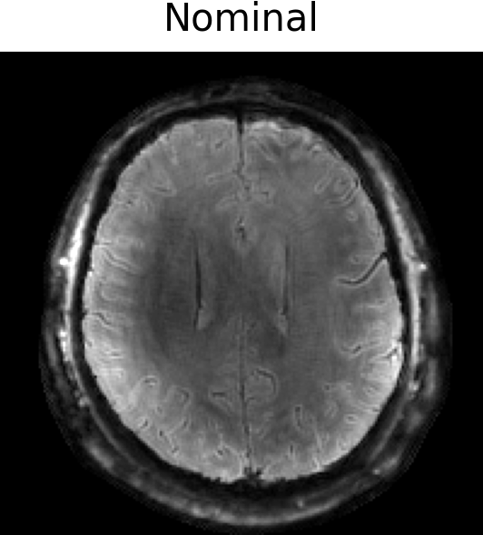
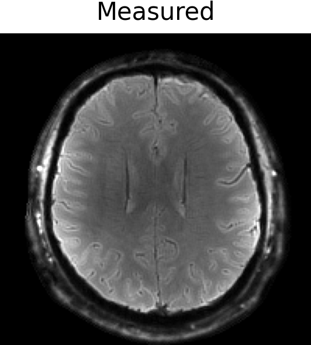
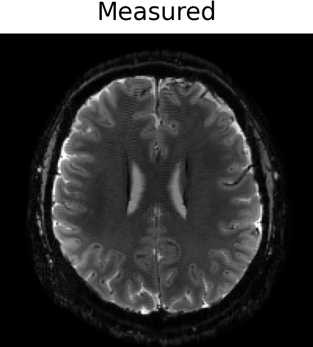

# HighOrderMRI.jl

[](https://github.com/BennyZhang-Codes/HighOrderMRI.jl/actions/workflows/ci.yml)
[](https://github.com/BennyZhang-Codes/HighOrderMRI.jl/actions/workflows/documentation.yml)
[](https://bennyzhang-codes.github.io/HighOrderMRI.jl/dev/)

HighOrderMRI.jl is a Julia toolbox for non-Cartesian MRI reconstruction with
measured or predicted dynamic higher-order fields. It provides explicit
encoding operators for numerical reference and a matrix-free shared-subspace
operator for large 2D and 3D reconstruction.

## Features

- Expanded signal encoding through third-order real solid-harmonic terms.
- Parallel imaging, static off-resonance correction, and reconstruction masks.
- `HighOrderOp`: array-based explicit evaluation on CPU or CUDA.
- `HighOrderKernelOp`: fused explicit CUDA evaluation on one or more GPUs.
- `HighOrderLowRankOp`: per-dynamic matrix-free rSVD, adaptive global shared
  spatial basis, and a global-trajectory NFFT.
- Optional voxel-distributed multi-GPU rSVD setup and channel-distributed
  multi-GPU normal operators.
- GIRF-based field prediction and model-based field/data synchronization
  ([Dubovan and Baron, 2023](https://doi.org/10.1002/mrm.29460)).
- Raw complex reconstruction metrics and encoding-convention regression tests.

## Documentation

The [development documentation](https://bennyzhang-codes.github.io/HighOrderMRI.jl/dev/)
contains:

- installation and a first CPU example;
- the expanded signal model, units, basis order, and NFFT convention;
- the randomized SVD and global shared spatial-subspace derivation;
- operator selection, reconstruction, multi-GPU, and synchronization guides;
- the frozen reconstruction comparison protocol and generated API reference.

## Installation

HighOrderMRI.jl requires Julia 1.12 or later. CI tests both the minimum
supported Julia 1.12 release and the latest stable Julia 1.x release; the
documentation is also built with the latest stable release. The repository
currently carries `MRIGeometry` as a local subpackage, so clone the complete
repository:

```bash
git clone https://github.com/BennyZhang-Codes/HighOrderMRI.jl.git
cd HighOrderMRI.jl
julia --project=. -e 'using Pkg; Pkg.instantiate()'
```

Then start Julia with the project and load the package:

```julia
using HighOrderMRI
```

CUDA execution additionally requires a functional
[CUDA.jl](https://github.com/JuliaGPU/CUDA.jl) installation. Start Julia with
`--threads=auto` when multiple GPUs participate.

## Demo

For MRI reconstruction incorporating measured field dynamics, we first estimate the synchronization delay between the MRI data and the field measurements. The final reconstruction is then performed using the synchronized field dynamics.

The demo includes 2D single-shot spiral (7 T, 1 mm in-plane resolution,
approximately 29 ms readout) and 2D single-shot EPI (7 T, 1 mm in-plane
resolution, approximately 40 ms readout) data. It compares a nominal
k-space trajectory with field dynamics measured using a Dynamic Field Camera.

<table>
  <tr>
    <th colspan="4" style="text-align:center">2D Spiral (left) & 2D EPI (right)</th>
  </tr>
  <tr>
    <td></td>
    <td></td>
    <td></td>
    <td></td>
  </tr>
</table>

## Copyright & License Notice

This software is copyrighted by the Regents of the University of Minnesota and the Institute of Biophysics, Chinese Academy of Sciences. It can be freely used for educational and research purposes by non-profit institutions, US government agencies, and Chinese government agencies only.
Other organizations are allowed to use this software only for evaluation purposes, and any further uses will require prior approval. The software may not be sold or redistributed without prior approval.
One may make copies of the software for their use provided that the copies are not sold or distributed, and are used under the same terms and conditions.
As unestablished research software, this code is provided on an "as is'' basis without warranty of any kind, either expressed or implied.
The downloading, or executing any part of this software constitutes an implicit agreement to these terms. These terms and conditions are subject to change at any time without prior notice.
