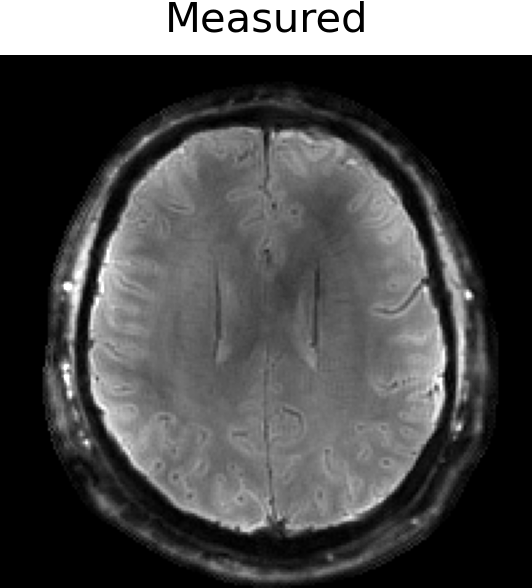
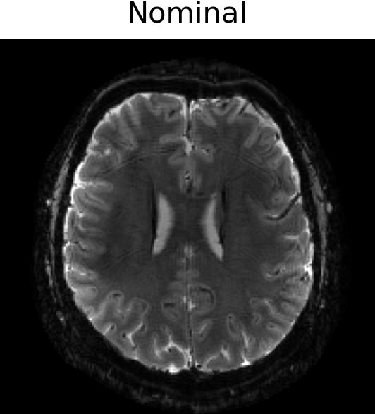

## Features

* Supports **up to 3rd order** spherical harmonic terms.
* Implements **parallel imaging** and **off-resonance correction** using the extended signal encoding operator `HighOrderOp`.
* fast HighOrderOp ...
* Integrates a **model-based synchronization delay estimation algorithm** ([Dubovan PI, Baron CA, 2023](https://doi.org/10.1002/mrm.29460)).
* Enables **GPU acceleration** with `CUDA.jl` (tested on NVIDIA GPUs). If GPU memory is insufficient, computations can be processed in blocks.

## Installation

This package relies on and **MRIReco.jl** (version 0.9.0).

```julia
using Pkg
Pkg.add(url="https://github.com/BennyZhang-Codes/HighOrderMRI.jl.git")
```

## Demo_2D

For MRI reconstruction incorporating measured field dynamics, we first estimate the synchronization delay between the MRI data and the field measurements. The final reconstruction is then performed using the synchronized field dynamics.

This demo includes 2D single-shot spiral (7T, 1 mm in-plane resolution, ~29 ms readout) and 2D single-shot EPI (7T, 1 mm in-plane resolution, ~40 ms readout) imaging data, nominal kspace trajectory (Nominal) and measured field dynamics (using Dynamic Field Camera).

<table>
  <tr>
    <th colspan="4" style="text-align:center">2D Spiral (left) & 2D EPI (right)</th>
  </tr>
  <tr>
    <td></td>
    <td></td>
    <td></td>
    <td></td>
  </tr>
</table>
## Copyright & License Notice
