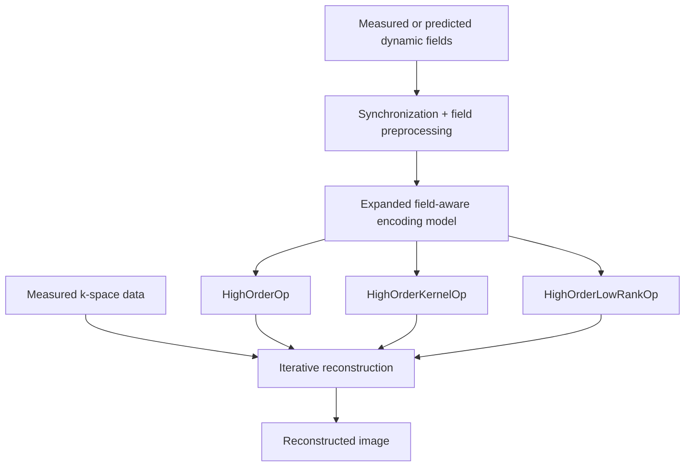

# HighOrderMRI.jl overview

HighOrderMRI.jl implements a field-aware MRI reconstruction framework in which the physical signal model is kept fixed while the numerical realization of the encoding operator can be changed according to the problem size and available hardware.

The three operators therefore differ in computational strategy rather than in the target physical model: `HighOrderOp` evaluates the expanded encoding explicitly, `HighOrderKernelOp` performs the same explicit calculation with fused CUDA kernels, and `HighOrderLowRankOp` introduces a controlled approximation of the residual spatial phase term.

## Core components

### Dynamic field encoding

The encoding model combines Cartesian or non-Cartesian sampling, receive-coil sensitivities, static off-resonance, and spatially varying dynamic field terms. The current high-order encoding constructors support real solid-harmonic terms through third order.

### Explicit implementations

`HighOrderOp` provides the array-based explicit implementation, whereas `HighOrderKernelOp` evaluates the same model using fused CUDA kernels and supported multi-GPU execution. Agreement between these implementations assesses numerical consistency of the software pathways; it is not, by itself, an independent validation of the underlying physical model.

### Low-rank acceleration

`HighOrderLowRankOp` accelerates repeated forward and adjoint evaluations using per-dynamic randomized SVD followed by an adaptive spatial basis shared across dynamics. The approximation is restricted to the residual spatial phase representation; first-order Fourier encoding remains in the NFFT. The factorization and coefficient conventions are derived in [Low-rank shared subspace](/theory/low-rank).

### Validation strategy

Validation is organized hierarchically. Explicit-implementation agreement, low-rank approximation error, independent numerical validation, and physical validation address distinct questions and should be reported separately. The [scientific validation strategy](/guide/validation) defines these evidence levels, and the [reconstruction protocol](/guide/reconstruction-protocol) specifies the conventions that should remain fixed during controlled comparisons.
