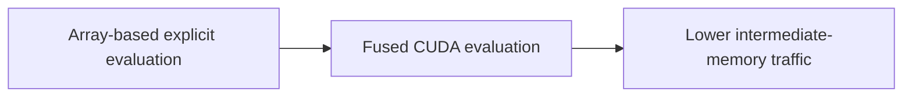
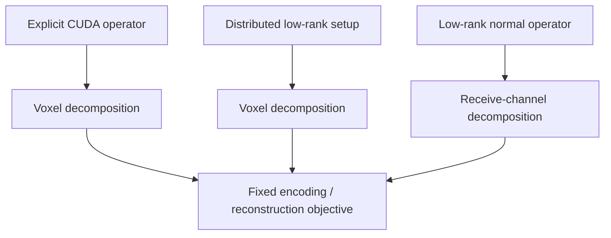

# Performance & benchmarking

HighOrderMRI.jl targets large-scale Cartesian and non-Cartesian MRI reconstruction in which repeated forward and adjoint operator evaluations account for a substantial fraction of the computational cost.

Performance comparisons are interpretable only when the compared implementations represent the same fixed signal model and when approximation error is reported together with runtime and memory. The representative measurements below apply only to their stated datasets, precision, and solver conditions; they do not establish a general speedup factor.

## CUDA kernel acceleration

`HighOrderKernelOp` evaluates explicit high-order encoding using fused CUDA kernels. The implementation avoids materialization of a complete sample-by-voxel phase matrix and evaluates the encoding directly on the GPU.

Runtime depends on matrix dimensions, sample count, receive-channel count, mask size, GPU hardware, numerical precision, and launch/transfer overhead. A speedup factor should therefore be reported only for a fully specified benchmark configuration.

Because `HighOrderKernelOp` is an explicit implementation of the same encoding equation as `HighOrderOp`, numerical agreement should first be established on a tractable problem before the timing results are interpreted.

## Multi-GPU execution

Different workload decompositions are used for different computational stages:

The explicit CUDA operator and distributed rSVD setup shard masked voxels. The optional low-rank normal backend shards receive channels. Forward-sample sharding is not used by the current explicit operator. See [Multi-GPU execution](/guide/multi-gpu) for the corresponding algebra and communication model.

For a fixed problem, multi-GPU scaling can be summarized using

$$
S_G = \frac{T_1}{T_G},
\qquad
E_G = \frac{S_G}{G},
$$

where $T_1$ and $T_G$ are synchronized steady-state runtimes using one and $G$ GPUs, respectively. These quantities should be reported separately for setup and iterative reconstruction because the two stages use different decompositions and communication patterns.

## Low-rank acceleration

By default, `HighOrderLowRankOp` reduces repeated operator cost by constructing per-dynamic randomized low-rank factors and incrementally recompressing their spatial factors into a shared spatial basis. First-order Fourier encoding remains in the NFFT. The underlying low-rank separation is related to previous singular-vector approaches to higher-order reconstruction. [[2]](/references#ref-2 "Wilm BJ, Barmet C, Pruessmann KP. Fast higher-order MR image reconstruction using singular-vector separation. IEEE Trans Med Imaging. 2012;31:1396-1403.")

If the final shared rank is $R$ and the number of receive channels is $N_c$, one forward or adjoint application requires

$$
N_{\mathrm{NFFT}}
=
R N_c
$$

NFFT evaluations. This is a transform-count relation; execution time additionally depends on sample count, grid size, memory traffic, backend, and hardware. A normal-operator application contains both forward- and adjoint-equivalent work, so its cost should be measured directly rather than inferred from the single-direction transform count alone.

The experimental [joint method](/theory/low-rank#direct-joint-shared-basis)
constructs one basis from representative phase snapshots and fits temporal
coefficients directly. This can reduce setup substantially when dynamics share
a compact spatial subspace. It does not guarantee a smaller rank or faster
reconstruction for every dataset. Increasing $R$ increases both factor storage
and the number of NFFTs.

## Representative measurements

These measurements use Float32 factors, five RTX 3090 GPUs (24 GiB each,
physical IDs 2–6), six Julia and six BLAS threads, Julia 1.12.7, CUDA.jl 6.2.1,
and NonuniformFFTs.jl 0.9.6. Channel-distributed normal evaluation is used
throughout. No fast-math, TF32, or half-precision mode is enabled.

The two workloads are:

- **3D spiral:** $220\times220\times160$ grid, 1232 samples × 1280 dynamics,
  5,135,544 masked voxels, 32 original coils, 20 CG iterations.
- **3D EPI:** $120\times148\times160$ grid, 16,320 samples × 30 dynamics,
  683,446 masked voxels, the same fixed 40-coil compressed input for each
  comparison, 10 CG iterations.

Coil maps, data, masks, weights, regularization, and solver conditions are
held fixed within each comparison. Timings from different coil counts or
iteration counts should not be combined.

### Fused rSVD column batching

Reducing the column batch from 32 to 16 retains the same factorization and
full Gram matrix while lowering the cost of its fused products. Spiral uses
`L_rank=15`, oversampling 5, and shared tolerance `1e-2`. EPI uses
`L_rank=80`, oversampling 16, shared tolerance `1e-2`, and global tolerance
`2e-2`. The resulting shared ranks remain 18 and 71.

| Workload | Columns per batch | Setup (s) | CG workflow (s) | Setup + CG (s) |
|:--|--:|--:|--:|--:|
| 3D spiral | 32 | 279.622 | 54.486 | 334.109 |
| 3D spiral | 16 | 179.483 | 55.499 | 234.981 |
| 3D EPI | 32 | 93.384 | 65.608 | 158.991 |
| 3D EPI | 16 | 34.583 | 65.691 | 100.274 |

These are medians of two warm complete calls per variant after an initial
call; compilation is excluded. The observed setup-plus-CG reductions are
29.7% and 36.9%, with no demonstrated CG speedup. Raw complex image differences
are at most $3.3\times10^{-6}$ and $5.3\times10^{-7}$, below the fixed
$10^{-4}$ replacement threshold. Two repeats are useful implementation
evidence, but do not meet the five-repeat publication protocol below.

The batch width is an internal implementation choice, not a rank truncation
or a public tuning parameter. Sketches of at most 16 columns use one launch
per product.

### Automatic joint construction

Joint construction includes snapshot selection, basis construction, rank
search, coefficient fitting, independent audit, and the primary NFFT plan.
The CG workflow includes channel-backend setup, RHS evaluation, solving, and
image transfer. These timings are not isolated factorization or kernel times.

Both cases below use `shared_basis_tol=1f-2`, `joint_samples=512`,
`rsvd_chunk=32768`, `rsvd_seed=1234`, and `global_basis_tol=nothing`.
Spiral uses 128 snapshots and rank cap 32; EPI uses 512 snapshots and rank
cap 256. The joint tolerance checks the sampled original phase model,
whereas the rSVD shared tolerance controls incremental factor compression.
Equal parameter values do not imply equal approximation errors.

| Workload | Selected rank | Timing scope | Setup (s) | CG workflow (s) | Setup + CG (s) |
|:--|--:|:--|--:|--:|--:|
| 3D spiral | 16 | One warm complete call | 12.451 | 48.231 | 60.682 |
| 3D EPI | 160 | One first call, including JIT | 75.538 | 174.450 | 249.988 |

Spiral's first call took 158.809 s for setup plus CG; the warm call took
65.545 s when input loading and upload were also included. Each call rebuilt
the operator and normal backend. The two spiral images differed by
$3.23\times10^{-6}$ in raw complex relative norm. These single-call
integration measurements do not establish a steady-state speedup ratio for
the automatic method.

| Workload | Worst dynamic, random-voxel audit | Worst dynamic, high-$\lvert B_0\rvert$ audit | Single copy of temporal + spatial factors |
|:--|--:|--:|--:|
| 3D spiral, $R=16$ | 0.6563% | 4.0255% | 0.8002 GiB |
| 3D EPI, $R=160$ | 0.9415% | 141.47% | 1.3984 GiB |

::: warning Accuracy and memory scope
Both cases pass the sampled random-voxel 1% target and fail the sampled
high-$|B_0|$ 1% target. Enabling `joint_roi_tol=1f-2` rejects these factors.
Neither audit is a full-matrix or image-error certificate. EPI's joint rank
is larger than its rSVD rank; joint is not a universal compression improvement.
:::

Factor sizes exclude NFFT plans, temporary phase matrices, data, coil maps,
and copies on channel workers. Measured warm normal calls allocated zero GPU
bytes, but still allocated approximately 15.5 MB on the CPU for spiral and
191.7 MB for EPI. The method changes setup, not the existing normal/NFFT worker
implementation. A lower factor size alone does not establish lower peak
device memory.

## Backend and precision tradeoffs

The main spiral setup profile spent about 104.0 s in forward rSVD products,
57.5 s in adjoint plus Gram, 3.0 s in QR, and 1.4 s in finalization.
Optimizing only the small final eigendecomposition cannot remove the dominant
phase-product cost.

Explicit multi-GPU `:chunked` construction remains an alternative backend,
not the default speed recommendation. A full 30-dynamic EPI comparison took
572 s for chunked setup versus 148 s for the fused kernel, with rank 66 in
both cases. That comparison used different compression tolerances from the
rank-71 table above. Small GEMM microbenchmarks did not predict the complete
setup cost.

Gram finalization squares the condition number of the projected matrix.
Computing its eigendecomposition in Float64 cannot restore weak directions
lost while accumulating the Gram in Float32. Direct SVD or a QR/SVD
factorization can preserve those directions more reliably, but its complete
cost must include tall-matrix QR, communication, and scratch space. See
[numerical methods](/theory/low-rank#relation-to-previous-methods). [[22]](/references#ref-22 "Demmel J, Grigori L, Hoemmen M, Langou J. Communication-optimal parallel and sequential QR and LU factorizations. SIAM J Sci Comput. 2012;34:A206-A239.")

The default local rSVD rank remains user-selected. Automatic joint rank
selection applies to the shared basis, not to each local rSVD. Fixed-precision
local QB is a separate algorithmic option requiring orthogonality and residual
checks; it is not exposed by the current constructor. [[21]](/references#ref-21 "Yu W, Gu Y, Li Y. Efficient randomized algorithms for the fixed-precision low-rank matrix approximation. SIAM J Matrix Anal Appl. 2018;39:1339-1359.")

## Setup cost and amortization

Low-rank setup is a separate computational stage and should not be hidden inside steady-state operator timing. Report at least:

- operator/setup time;
- steady-state forward and adjoint time;
- weighted normal-operator time;
- solver time;
- complete end-to-end time.

When the low-rank operator is reused for repeated iterations or reconstructions, the number of applications required to amortize setup can also be reported. For two methods with steady-state application times $T_{\mathrm{ref}}$ and $T_{\mathrm{lr}}$, and low-rank setup cost $T_{\mathrm{setup}}$, a simple break-even estimate is

$$
N_{\mathrm{break}}
\approx
\frac{T_{\mathrm{setup}}}{T_{\mathrm{ref}}-T_{\mathrm{lr}}},
$$

provided $T_{\mathrm{lr}}<T_{\mathrm{ref}}$. The definition of an "application" must be stated—for example forward, adjoint, normal, or one solver iteration.

## Comparison set

A methods benchmark should separate the effects of the two low-rank approximation stages. When computationally feasible, include:

1. an explicit high-order operator;
2. independent per-dynamic rank-$L$ factors without shared spatial recompression;
3. a direct global SVD/rSVD or equivalent post-hoc shared subspace;
4. the incremental shared-basis implementation;
5. the joint snapshot construction with its independent sampled audit.

The direct global construction provides an approximation-quality reference because all dynamics can be considered jointly, although its memory requirement may be substantially larger. The incremental method should therefore be evaluated using the combined approximation-error, memory, setup-cost, and steady-state-runtime trade-off rather than shared rank alone.

## Accuracy-matched timing

A timing comparison is only like-for-like when the numerical objectives and approximation tolerances are comparable. For low-rank sweeps, report runtime and memory together with the corresponding forward/adjoint/normal error or reconstruction error. If two methods operate at materially different error levels, they should be presented as different accuracy–performance operating points rather than as a single speedup ratio.

## Reporting

A performance study should report, at minimum:

- problem dimensions, sample count, dynamics, receive channels, and mask size;
- operator type and all low-rank parameters, including the local and final shared ranks;
- GPU model and UUID, CUDA and Julia versions, and host thread count;
- setup, forward, adjoint, normal-operator, solver, and end-to-end timings;
- at least five synchronized steady-state repetitions, summarized using median and interquartile range;
- peak host and device memory, together with the measurement method and sampling resolution where relevant;
- forward, adjoint, normal-operator, adjointness, and reconstruction errors relative to the stated reference;
- identical solver, regularization, density weights, coil compression, initialization, precision, and stopping criteria across compared methods;
- single- and multi-GPU results separately when scaling is evaluated.

A speedup should be interpreted together with the corresponding approximation error, setup cost, and memory requirement. Methods evaluated at different approximation errors represent different operating points and should not be presented as a like-for-like timing comparison.

Use [Scientific validation strategy](/guide/validation) to define the evidence level and comparison baselines, and the [Reconstruction protocol](/guide/reconstruction-protocol) to fix numerical conventions before generating benchmark results.
