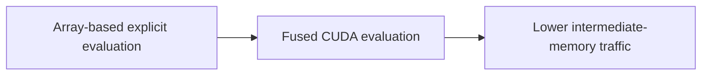
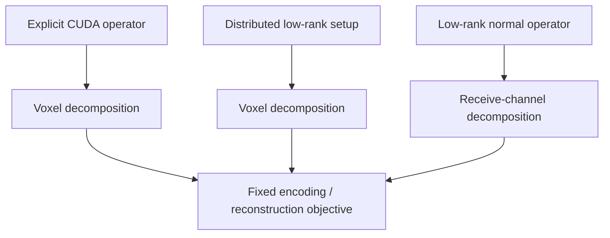

# Performance & benchmarking

HighOrderMRI.jl targets large-scale Cartesian and non-Cartesian MRI reconstruction in which repeated forward and adjoint operator evaluations account for a substantial fraction of the computational cost.

Performance comparisons are interpretable only when the compared implementations represent the same fixed signal model and when approximation error is reported together with runtime and memory. Until a benchmark dataset and software release are fixed, this page specifies the benchmarking methodology rather than a general speedup factor.

## CUDA kernel acceleration

`HighOrderKernelOp` evaluates explicit high-order encoding using fused CUDA kernels. The implementation avoids materialization of a complete sample-by-voxel phase matrix and evaluates the encoding directly on the GPU.

Runtime depends on matrix dimensions, sample count, receive-channel count, mask size, GPU hardware, numerical precision, and launch/transfer overhead. A speedup factor should therefore be reported only for a fully specified benchmark configuration.

Because `HighOrderKernelOp` is an explicit implementation of the same encoding equation as `HighOrderOp`, numerical agreement should first be established on a tractable problem before the timing results are interpreted.

## Multi-GPU execution

Different workload decompositions are used for different computational stages:

The explicit CUDA operator and distributed rSVD setup shard masked voxels. The optional low-rank normal backend shards receive channels. Forward-sample sharding is not used by the current explicit operator. See [Multi-GPU execution](/guide/multi-gpu) for the corresponding algebra and communication model.

For a fixed problem, multi-GPU scaling can be summarized using

$$
S_G = \frac{T_1}{T_G},
\qquad
E_G = \frac{S_G}{G},
$$

where $T_1$ and $T_G$ are synchronized steady-state runtimes using one and $G$ GPUs, respectively. These quantities should be reported separately for setup and iterative reconstruction because the two stages use different decompositions and communication patterns.

## Low-rank acceleration

`HighOrderLowRankOp` reduces repeated operator cost by constructing per-dynamic randomized low-rank factors and incrementally recompressing their spatial factors into a shared spatial basis. First-order Fourier encoding remains in the NFFT. The underlying low-rank separation is related to previous singular-vector approaches to higher-order reconstruction. [[2]](/references#ref-2 "Wilm BJ, Barmet C, Pruessmann KP. Fast higher-order MR image reconstruction using singular-vector separation. IEEE Trans Med Imaging. 2012;31:1396-1403.")

If the final shared rank is $R$ and the number of receive channels is $N_c$, one forward or adjoint application requires

$$
N_{\mathrm{NFFT}}
=
R N_c
$$

NFFT evaluations. This is a transform-count relation; execution time additionally depends on sample count, grid size, memory traffic, backend, and hardware. A normal-operator application contains both forward- and adjoint-equivalent work, so its cost should be measured directly rather than inferred from the single-direction transform count alone.

## Setup cost and amortization

Low-rank setup is a separate computational stage and should not be hidden inside steady-state operator timing. Report at least:

- operator/setup time;
- steady-state forward and adjoint time;
- weighted normal-operator time;
- solver time;
- complete end-to-end time.

When the low-rank operator is reused for repeated iterations or reconstructions, the number of applications required to amortize setup can also be reported. For two methods with steady-state application times $T_{\mathrm{ref}}$ and $T_{\mathrm{lr}}$, and low-rank setup cost $T_{\mathrm{setup}}$, a simple break-even estimate is

$$
N_{\mathrm{break}}
\approx
\frac{T_{\mathrm{setup}}}{T_{\mathrm{ref}}-T_{\mathrm{lr}}},
$$

provided $T_{\mathrm{lr}}<T_{\mathrm{ref}}$. The definition of an "application" must be stated—for example forward, adjoint, normal, or one solver iteration.

## Comparison set

A methods benchmark should separate the effects of the two low-rank approximation stages. When computationally feasible, include:

1. an explicit high-order operator;
2. independent per-dynamic rank-$L$ factors without shared spatial recompression;
3. a direct global SVD/rSVD or equivalent post-hoc shared subspace;
4. the incremental shared-basis implementation.

The direct global construction provides an approximation-quality reference because all dynamics can be considered jointly, although its memory requirement may be substantially larger. The incremental method should therefore be evaluated using the combined approximation-error, memory, setup-cost, and steady-state-runtime trade-off rather than shared rank alone.

## Accuracy-matched timing

A timing comparison is only like-for-like when the numerical objectives and approximation tolerances are comparable. For low-rank sweeps, report runtime and memory together with the corresponding forward/adjoint/normal error or reconstruction error. If two methods operate at materially different error levels, they should be presented as different accuracy–performance operating points rather than as a single speedup ratio.

## Reporting

A performance study should report, at minimum:

- problem dimensions, sample count, dynamics, receive channels, and mask size;
- operator type and all low-rank parameters, including the local and final shared ranks;
- GPU model and UUID, CUDA and Julia versions, and host thread count;
- setup, forward, adjoint, normal-operator, solver, and end-to-end timings;
- at least five synchronized steady-state repetitions, summarized using median and interquartile range;
- peak host and device memory, together with the measurement method and sampling resolution where relevant;
- forward, adjoint, normal-operator, adjointness, and reconstruction errors relative to the stated reference;
- identical solver, regularization, density weights, coil compression, initialization, precision, and stopping criteria across compared methods;
- single- and multi-GPU results separately when scaling is evaluated.

A speedup should be interpreted together with the corresponding approximation error, setup cost, and memory requirement. Methods evaluated at different approximation errors represent different operating points and should not be presented as a like-for-like timing comparison.

Use [Scientific validation strategy](/guide/validation) to define the evidence level and comparison baselines, and the [Reconstruction protocol](/guide/reconstruction-protocol) to fix numerical conventions before generating benchmark results.
