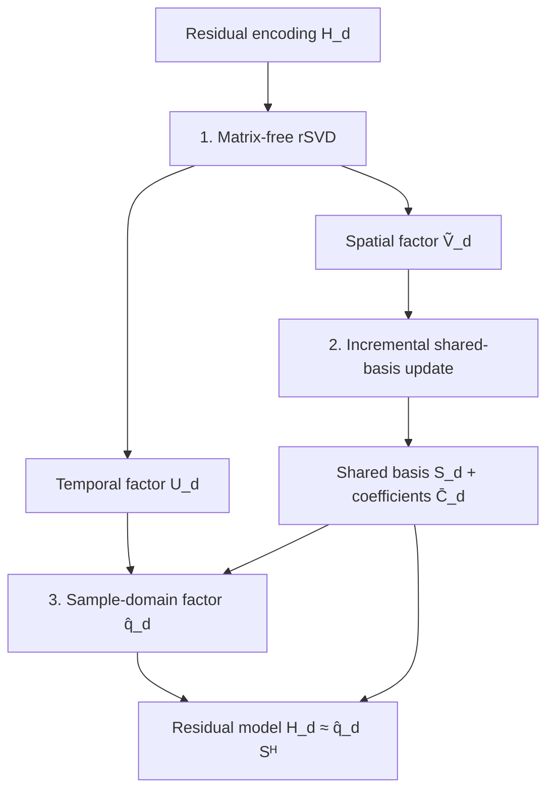

# Low-rank shared subspace

`HighOrderLowRankOp` reduces the cost of repeated applications of the expanded encoding model using two successive approximations: a matrix-free randomized SVD (rSVD) of each dynamic-specific residual encoding matrix, followed by incremental recompression of the retained spatial factors into a basis shared across dynamics. The image, coil sensitivities, and first-order Fourier trajectory are not themselves low-rank approximated.

Symbols follow [Symbols and notation](/theory/symbols).

## Method overview

The three stages are therefore local factorization, incremental spatial recompression, and assembly of the sample-domain coefficients used by the final operator. The shared basis is constructed sequentially. After a dynamic has been processed, its retained spatial factor is not stored for later reprojection. If subsequent dynamics append columns to the shared basis, the coefficient blocks of earlier dynamics are extended with zeros.

## Relation to previous methods

Separable temporal-spatial representations of higher-order MRI encoding have previously been obtained using singular-vector separation, and related decompositions are used in expanded-model reconstruction such as MaxGIRF. [[2]](/references#ref-2 "Wilm BJ, Barmet C, Pruessmann KP. Fast higher-order MR image reconstruction using singular-vector separation. IEEE Trans Med Imaging. 2012;31:1396-1403.") [[3]](/references#ref-3 "Lee NG, Ramasawmy R, Lim Y, Campbell-Washburn AE, Nayak KS. MaxGIRF: Image reconstruction incorporating concomitant field and gradient impulse response function effects. Magn Reson Med. 2022;88:691-710.") The randomized range-finding step used here follows standard rSVD methods. [[4]](/references#ref-4 "Halko N, Martinsson PG, Tropp JA. Finding structure with randomness: Probabilistic algorithms for constructing approximate matrix decompositions. SIAM Rev. 2011;53:217-288.")

HighOrderMRI combines matrix-free per-dynamic factorization with an incrementally constructed shared spatial basis and a global-trajectory NFFT representation. The resulting shared basis is not an exact post-hoc global SVD of all dynamic-specific matrices. Consequently, the Eckart-Young optimality result for a truncated SVD of a fixed matrix does not apply directly to the completed incremental representation. [[5]](/references#ref-5 "Eckart C, Young G. The approximation of one matrix by another of lower rank. Psychometrika. 1936;1:211-218.")

A direct global SVD/rSVD remains a useful approximation-quality reference when memory permits because all dynamics can be considered jointly. The incremental method instead targets memory-bounded construction and scalable execution. These alternatives are distinguished explicitly in [Scientific validation strategy](/guide/validation).

## Residual encoding matrix

For dynamic $d$, define

$$
H_d(j,v)
=
\exp\!\left\{
i2\pi\left[
t_{jd}\Delta f_{0,v}
+\sum_{\ell\in\mathcal R}
k_{\ell,jd}b_{\ell,v}
\right]\right\},
\qquad
H_d\in\mathbb C^{N_s\times N_v}.
$$

The zeroth-order temporal phase and the first-order Fourier terms are excluded from $H_d$. In 3D, $\mathcal R$ begins with the second-order terms. In 2D, the $z$ first-order term remains in $\mathcal R$ because only the $x$ and $y$ first-order terms are represented by the 2D NFFT. The full matrix $H_d$ is not explicitly materialized during low-rank setup.

## Per-dynamic randomized SVD

Let $L$ denote `L_rank`, $p$ denote `rsvd_oversample`, and $\ell=L+p$. For each dynamic, a random test matrix

$$
\Omega_d\in\mathbb C^{N_v\times\ell}
$$

is generated, and the randomized range sketch is computed as

$$
Y_d
=
H_d\Omega_d,
\qquad
Q_d
=
\operatorname{orth}(Y_d).
$$

The projected adjoint matrix is then

$$
B_d
=
H_d^H Q_d
\in
\mathbb C^{N_v\times\ell}.
$$

Products with $H_d$ and $H_d^H$ are evaluated matrix-free from `times`, `fieldmap`, the residual rows of `kspha`, and the corresponding spatial basis functions. For a fixed configuration, dynamic $d$ uses the deterministic seed

$$
s_d
=
s_0+d-1.
$$

### Direct SVD finalization

For `rsvd_finalize=:svd`, let

$$
B_d
=
P_d\Sigma_d Z_d^H.
$$

Retaining the first $L$ singular triplets gives

$$
U_d
=
Q_d Z_{d,L},
\qquad
\widetilde V_d
=
P_{d,L}\Sigma_{d,L},
$$

and therefore

$$
H_d
\approx
U_d\widetilde V_d^H.
$$

Because $Q_d$ and $Z_{d,L}$ have orthonormal columns,

$$
U_d^H U_d
=
I_L.
$$

The singular values are absorbed into the spatial factor $\widetilde V_d$. The retained local energy is therefore

$$
\eta_d
=
\lVert\widetilde V_d\rVert_F^2
=
\sum_{l=1}^{L}\sigma_{d,l}^2.
$$

### Small-Gram finalization

For `rsvd_finalize=:gram`, the implementation forms

$$
G_d
=
B_d^H B_d
\in
\mathbb C^{\ell\times\ell}
$$

and diagonalizes

$$
G_d
=
Z_d\Lambda_d Z_d^H,
\qquad
\Lambda_d
=
\Sigma_d^2.
$$

The retained factors are recovered as

$$
U_d
=
Q_d Z_{d,L},
\qquad
\widetilde V_d
=
B_d Z_{d,L}.
$$

If $B_d=P_d\Sigma_d Z_d^H$, then $B_dZ_{d,L}=P_{d,L}\Sigma_{d,L}$; thus, in exact arithmetic, the Gram and direct-SVD routes produce the same retained factorization. The Gram formulation avoids a direct SVD of the tall $N_v\times\ell$ matrix but squares its condition number. The single-device implementation checks for non-finite values, significant negative eigenvalues, and degeneracy and can fall back to the direct SVD if the Gram result fails these checks.

## Incremental shared spatial basis

Independent local factorizations would retain up to $N_dL$ spatial columns. HighOrderMRI instead constructs one orthonormal spatial basis sequentially across dynamics.

Before processing dynamic $d$, let

$$
S_{d-1}
\in
\mathbb C^{N_v\times R_{d-1}},
\qquad
S_{d-1}^H S_{d-1}
=
I.
$$

The current spatial factor is first projected onto the existing basis,

$$
C_d^{\mathrm{old}}
=
S_{d-1}^H\widetilde V_d,
$$

and the residual is

$$
R_d
=
\widetilde V_d
-
S_{d-1}C_d^{\mathrm{old}}.
$$

A second projection/subtraction is performed in the implementation and the corresponding correction is accumulated in $C_d^{\mathrm{old}}$ to reduce finite-precision loss of orthogonality.

The residual Gram matrix is decomposed as

$$
R_d^H R_d
=
T_d\Lambda_d^{(R)}T_d^H.
$$

The minimum number $r_d$ of additional basis vectors is selected such that

$$
\sqrt{
\frac{
\sum_{i=r_d+1}^{L}\lambda_{d,i}^{(R)}
}{
\eta_d
}}
\leq
\tau,
$$

where $\tau$ is `shared_basis_tol`. The denominator $\eta_d$ is the retained energy of the local rank-$L$ factor, not the energy of the untruncated matrix $H_d$.

For the selected positive residual eigenvalues, the appended basis vectors are

$$
S_{d,\mathrm{new}}
=
R_dT_{d,1:r_d}
\left[\Lambda_{d,1:r_d}^{(R)}\right]^{-1/2}.
$$

The basis is updated according to

$$
S_d
=
\begin{bmatrix}
S_{d-1}&S_{d,\mathrm{new}}
\end{bmatrix},
$$

and the coefficient block for the current dynamic is completed as

$$
C_d^{\mathrm{new}}
=
S_{d,\mathrm{new}}^H\widetilde V_d,
\qquad
\bar C_d
=
\begin{bmatrix}
C_d^{\mathrm{old}}\\
C_d^{\mathrm{new}}
\end{bmatrix}.
$$

At the time dynamic $d$ is inserted,

$$
\widetilde V_d
\approx
S_d\bar C_d.
$$

If the required accumulated rank would exceed `shared_rank_max`, setup terminates with an error rather than relaxing the requested rank bound.

### Streaming coefficient representation

The implementation is memory bounded: after dynamic $d$ has been processed, $\widetilde V_d$ is not retained. When later dynamics append basis columns, earlier coefficient blocks are extended with zeros rather than recomputed.

Let

$$
S
\equiv
S_{N_d}
\in
\mathbb C^{N_v\times R}
$$

be the completed shared basis, and let $\bar C_d\in\mathbb C^{R\times L}$ denote the stored coefficient block for dynamic $d$ after zero-padding to the final rank. The implementation satisfies the approximation

$$
\widetilde V_d
\approx
S\bar C_d.
$$

For an earlier dynamic, however, the stored coefficient block is generally not the orthogonal projection onto the completed basis:

$$
\bar C_d
\neq
S^H\widetilde V_d.
$$

Appending basis columns and padding earlier coefficient blocks with zeros leaves the previously stored approximation unchanged. The final coefficients should therefore be interpreted as streaming coefficients associated with the incremental construction, rather than as coefficients from a post-hoc global projection.

## Final residual representation

Define the unscaled sample-domain factor

$$
\widehat q_d
=
U_d\bar C_d^H
\in
\mathbb C^{N_s\times R}.
$$

Then

$$
H_d
\approx
\widehat q_d S^H.
$$

All $\widehat q_d$ blocks are concatenated with samples as the fastest-changing index and dynamics as the next index. The stored coefficient matrix additionally incorporates three sample-domain factors:

1. the zeroth-order phase $\exp(i2\pi k_{0,jd})$;
2. the parity-dependent NFFT centre correction;
3. the symmetric normalization $1/\sqrt{N_v}$.

If $d_{0,jd}$ denotes the zeroth-order phase and $c_{\mathrm{ctr},jd}$ the centre correction, the stored rows are

$$
q_d(j,:)
=
\frac{d_{0,jd}\,c_{\mathrm{ctr},jd}}{\sqrt{N_v}}
\widehat q_d(j,:).
$$

The first-order Fourier phase remains in the NFFT and is not included in $H_d$ or $\widehat q_d$.

## Forward and adjoint operators

Let $\mathcal F$ denote the global NFFT containing the first-order trajectories of all dynamics, let $s_r$ denote column $r$ of the completed shared basis, and let $q_r$ denote column $r$ of the stored sample-domain coefficient matrix. For receive coil $c$,

$$
A_c m
\approx
\sum_{r=1}^{R}
\operatorname{diag}(q_r)
\mathcal F
\left(m\odot C_c\odot s_r^*\right).
$$

The complex conjugation of $s_r$ follows from $H_d\approx\widehat q_dS^H$.

The corresponding multi-coil adjoint is

$$
A^Hy
\approx
\sum_{r=1}^{R}
s_r\odot
\sum_{c=1}^{N_c}
C_c^*\odot
\mathcal F^H
\left(q_r^*\odot y_c\right).
$$

These expressions agree with the implemented conjugation pattern: the forward operator multiplies the image by the conjugated shared-basis vector and coil sensitivity before the NFFT, whereas the adjoint applies the conjugated temporal coefficient, the NFFT adjoint, the conjugated coil sensitivity, and the non-conjugated shared-basis vector.

The number of NFFT evaluations per forward or adjoint application is

$$
N_{\mathrm{NFFT}}
=
R N_c.
$$

For independent per-dynamic spatial factorizations, the corresponding transform count would scale approximately as $N_dLN_c$. This comparison concerns the number of NFFT evaluations and does not imply runtime independence from the number of samples or dynamics.

## Two-stage approximation error

Before applying zeroth-order, centre-correction, and normalization factors, the approximation is

$$
H_d
\longrightarrow
U_d\widetilde V_d^H
\longrightarrow
U_d\bar C_d^H S^H
=
\widehat q_dS^H.
$$

The triangle inequality gives

$$
\begin{aligned}
\lVert H_d-\widehat q_dS^H\rVert_F
&\leq
\lVert H_d-U_d\widetilde V_d^H\rVert_F\\
&\quad+
\lVert U_d(\widetilde V_d-S\bar C_d)^H\rVert_F.
\end{aligned}
$$

Since $U_d^HU_d=I_L$,

$$
\lVert U_d(\widetilde V_d-S\bar C_d)^H\rVert_F
=
\lVert\widetilde V_d-S\bar C_d\rVert_F,
$$

and therefore

$$
\lVert H_d-\widehat q_dS^H\rVert_F
\leq
\lVert H_d-U_d\widetilde V_d^H\rVert_F
+
\lVert\widetilde V_d-S\bar C_d\rVert_F.
$$

The first term is the local rSVD approximation error and the second term is the incremental shared-basis approximation error. `shared_basis_tol` controls only the second stage relative to the retained local energy $\eta_d$; it does not bound the local rSVD truncation error relative to the full matrix $H_d$.

## Parameter interpretation

| Parameter | Role | Recommended check |
|---|---|---|
| `L_rank` | Local truncation rank | Sweep against an explicit operator or independent dense reference |
| `rsvd_oversample` | Additional random sketch directions | Verify `L_rank + rsvd_oversample ≤ min(nSam,nVox)` |
| `rsvd_seed` | Reproducible random sketch schedule | Repeat with several seeds in a final sensitivity analysis |
| `rsvd_finalize` | `:svd` or memory-saving `:gram` | Compare retained spectra and operator errors on a tractable problem |
| `shared_basis_tol` | Incremental second-stage residual tolerance | Report together with the final `shared_rank` |
| `shared_rank_max` | Hard cap on accumulated shared rank | Treat an exceeded cap as a configuration failure |
| `rsvd_backend` | `:chunked` or fused CUDA `:kernel` | The fused kernel requires `L_rank + rsvd_oversample ≤ 32` |

The local rank $L$ and final shared rank $R$ describe different approximations. $L$ controls the per-dynamic rSVD truncation, whereas $R$ is the dimension accumulated by the shared spatial representation. Thus, $R$ may be smaller than, equal to, or larger than $L$.

Rank selection should not be based on a single reconstructed image. At minimum, forward error, adjointness, normal-operator error, reconstruction error, seed sensitivity, shared rank, and final solver residual should be examined. The [Scientific validation strategy](/guide/validation) defines the comparison hierarchy, and the [Reconstruction protocol](/guide/reconstruction-protocol) defines the fixed metrics and timing boundaries.

## Validation scope

Regression tests assess consistency of phase sign, coordinate convention, NFFT node mapping, centring, normalization, masking, data layout, and adjointness on tractable problems. These tests establish implementation consistency but do not constitute an independent physical reference. Validation of absolute physical accuracy requires independent simulation or measured reference data.
